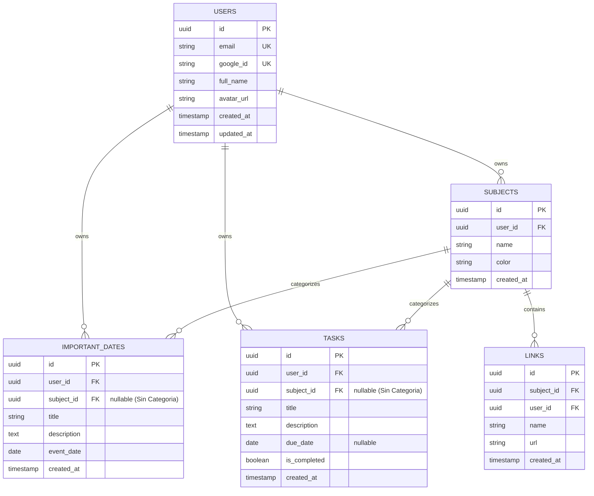

# Plan de Arquitectura e Implementación: EstuPlani

## 1. Visión General del Proyecto
**EstuPlani** es una plataforma web para estudiantes universitarios diseñada para gestionar fechas importantes (exámenes, entregas, turnos), tareas pendientes (To-Do list), materias/categorías y enlaces de interés. 

El foco principal del proyecto es ofrecer **máximo rendimiento**, **bajo consumo de recursos** y **alta concurrencia**, permitiendo escalar a miles de usuarios activos con costos mínimos de infraestructura.

---

## 2. Decisiones Arquitectónicas y Tecnológicas

### 2.1 Backend (Rust + Axum + Tokio + SQLx)
* **Lenguaje y Framework**: **Rust** con **Axum** sobre el runtime asíncrono **Tokio**.
  * *Razón*: Manejo de concurrencia a nivel de sistema operativo sin recolector de basura (GC pauses), memoria RAM base < 30 MB por instancia, y máxima velocidad de respuesta (sub-milisegundo en lógica pura).
* **Acceso a Datos**: **SQLx** con **PostgreSQL**.
  * *Razón*: Pool de conexiones asíncrono (`PgPool`), consultas SQL verificadas en tiempo de compilación y control exacto de las sentencias sin sobrecarga de ORM pesado.
* **Autenticación**: **Google OAuth 2.0 + Stateless JWT**.
  * *Razón*: El backend verifica el token de Google al iniciar sesión y emite un JWT firmado por el backend con expiración. Esto permite que las peticiones subsiguientes se autentiquen sin golpear la base de datos para validar sesión.

### 2.2 Frontend (React + Vite + TypeScript)
* **Estructura**: Single Page Application (SPA) construida con **Vite** y **TypeScript**.
* **Estilizado**: CSS moderno (Vanilla CSS / Design System modular con variables CSS) enfocado en una interfaz limpia, responsiva, con modo oscuro y micro-animaciones.
* **Despliegue**: Build estático en **CDN Edge** (Cloudflare Pages o Vercel), logrando latencias ultra bajas y costo cero de ancho de banda para el servidor de backend.

### 2.3 Base de Datos (PostgreSQL)
* Índices optimizados para multi-tenancy por `user_id` y ordenamiento cronológico.

---

## 3. Modelo de Datos Relacional



---

## 4. Estructura del Proyecto (Monorepo)

```text
EstuPlani/
├── backend/
│   ├── Cargo.toml
│   ├── .env.example
│   ├── migrations/
│   │   ├── 0001_create_users.sql
│   │   ├── 0002_create_subjects.sql
│   │   ├── 0003_create_important_dates.sql
│   │   ├── 0004_create_tasks.sql
│   │   └── 0005_create_links.sql
│   └── src/
│       ├── main.rs
│       ├── config.rs
│       ├── state.rs
│       ├── auth/
│       │   ├── mod.rs
│       │   ├── google.rs
│       │   ├── jwt.rs
│       │   └── middleware.rs
│       ├── models/
│       │   ├── mod.rs
│       │   ├── user.rs
│       │   ├── subject.rs
│       │   ├── important_date.rs
│       │   ├── task.rs
│       │   └── link.rs
│       └── routes/
│           ├── mod.rs
│           ├── auth.rs
│           ├── subjects.rs
│           ├── dates.rs
│           ├── tasks.rs
│           └── links.rs
├── frontend/
│   ├── package.json
│   ├── tsconfig.json
│   ├── vite.config.ts
│   ├── index.html
│   └── src/
│       ├── main.tsx
│       ├── App.tsx
│       ├── api/
│       ├── components/
│       │   ├── Navbar.tsx
│       │   ├── DateCard.tsx
│       │   ├── TaskItem.tsx
│       │   ├── SubjectModal.tsx
│       │   └── CountdownBadge.tsx
│       ├── context/
│       │   └── AuthContext.tsx
│       ├── pages/
│       │   ├── Dashboard.tsx
│       │   ├── SubjectDetail.tsx
│       │   └── Login.tsx
│       └── styles/
│           └── index.css
├── docker-compose.yml
├── .gitignore
├── PLAN.md
└── README.md
```

---

## 5. Fases de Implementación

### Fase 1: Infraestructura y Entorno Local
- Configurar `docker-compose.yml` con PostgreSQL y variables de entorno.
- Crear proyecto Rust en `backend/` con `Cargo.toml` (dependencias: `axum`, `tokio`, `sqlx`, `serde`, `jsonwebtoken`, `reqwest`, `tower-http`, `dotenvy`).
- Inicializar migraciones SQL con claves foráneas, índices y borrado en cascada.

### Fase 2: Backend Core y Autenticación
- Configurar estado compartido (`AppState`) con el pool de conexiones `PgPool`.
- Implementar flujo Google OAuth 2.0 (código $\rightarrow$ token $\rightarrow$ datos de usuario $\rightarrow$ creación/actualización en BD $\rightarrow$ emisión de JWT).
- Middleware de extracción y validación de JWT para proteger rutas (`AuthUser`).
- CRUDs para:
  - **Materias / Categorías**
  - **Fechas Importantes** (cálculo de días o filtrado cronológico)
  - **Tareas Pendientes** (toggle de completadas y filtrado)
  - **Enlaces útiles** asociados a materias

### Fase 3: Frontend y Experiencia de Usuario
- Crear proyecto Vite con React y TypeScript en `frontend/`.
- Sistema de diseño moderno en CSS (modo oscuro por defecto, tarjetas con glassmorphism, contrastes nítidos).
- Pantalla principal:
  - Tablero de **Fechas Importantes** con badge dinámico: `Faltan X días` o `Vencido`.
  - Lista de **Tareas Pendientes** con checkbox de estado y fecha opcional.
- Vista de **Materias**:
  - Filtro o navegación por materia específica.
  - Sección de **Notas y Recordatorios** de la cursada con autoguardado en tiempo real.
  - Sección de links con redirección directa.
- Integración con Google Login (botón OAuth y persistencia de sesión).

### Fase 4: Despliegue y Pruebas de Carga
- Generar `Dockerfile` multi-stage para compilar el binario Rust en una imagen ultraligera (~15-20 MB en Alpine o scratch).
- Configuración de despliegue en CDN (Cloudflare Pages o Vercel para frontend) y PaaS / VPS (Fly.io, Railway, Render o Hetzner para backend).

### Fase 5: Hardening de Seguridad y Mitigación de Vulnerabilidades (Completada)
- **Validación del claim `aud` (Audience) en Google OAuth**: Verificación criptográfica y coincidencia estricta con el Client ID de la app para evitar ataques de sustitución de tokens (*Confused Deputy*).
- **Eliminación del endpoint `/dev-login`**: Removido por completo del backend para prevenir accesos no autorizados a cuentas reales.
- **Prevención de Stored XSS**: Sanitización estricta de esquemas URL en frontend y backend (solo `http://` o `https://`, bloqueando esquemas `javascript:`, `data:` o `vbscript:`).
- **Cabeceras de Seguridad HTTP**: Inyección automática de `X-Content-Type-Options: nosniff`, `X-Frame-Options: DENY` y `Referrer-Policy: strict-origin-when-cross-origin`.
- **Protección contra Denegación de Servicio (DoS)**: Límite estricto de cuerpo de petición (`DefaultBodyLimit::max(256 * 1024)`).
- **Control de clave secreta JWT**: Exigencia obligatoria de `JWT_SECRET` seguro (>32 caracteres) y no predeterminado en entornos de producción.

---

## 6. Plan de Verificación

### Pruebas de Integración y API
- Compilación estricta con `cargo check` y `cargo clippy`.
- Pruebas de endpoints con tests de integración (`axum-test` o `reqwest`).
- Verificación de migraciones SQL con `sqlx migrate run`.

### Pruebas de Rendimiento
- Test de carga local con `k6` o `wrk` para verificar manejo de miles de peticiones por segundo con latencias inferiores a 5 ms.

### Pruebas de Interfaz
- Navegación fluida, responsive en móviles y escritorio.
- Comprobación de cálculos de fechas y zonas horarias locales.
